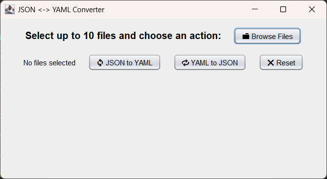
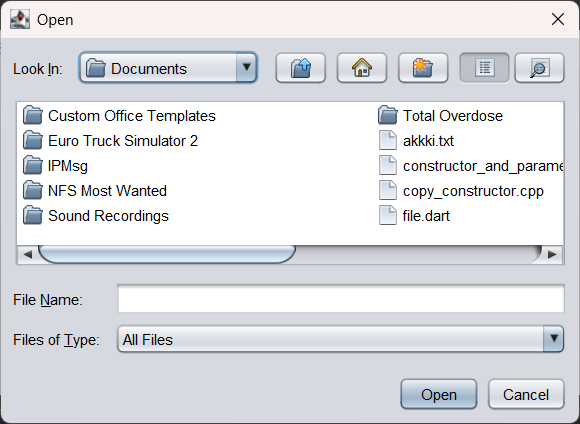
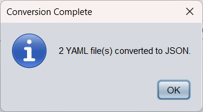

# 🔁 YJY Converter – JSON ↔ YAML Desktop GUI App

**YJY Converter** is a desktop application that enables users to convert data between **JSON** and **YAML** formats through a simple graphical interface. The app is built using **Java Swing for GUI** and connects to **custom-built Python scripts** that perform conversion **without using any external libraries** like `PyYAML`, `json`, or others.

---

## 📌 About the Project

This project stands out by focusing on **low-level implementation and deep control over data parsing**, rather than relying on pre-built libraries. The conversion logic in the Python backend is:

- **Manually implemented**: It parses and reconstructs JSON and YAML syntax from scratch.
- **Highly educational**: Designed to understand how serialization formats work internally.
- **Library-free**: No `import yaml`, `json`, or external tools. Just core Python.

> This manual approach improves transparency, gives full control over the conversion process, and is excellent for educational and learning purposes.

---

## ✨ Key Features

✅ Convert **JSON → YAML**  
✅ Convert **YAML → JSON**  
✅ **Batch conversion** (up to 10 files)  
✅ Clear, modern GUI built with **Java Swing**  
✅ Real-time execution of Python logic from Java using `ProcessBuilder`  
✅ Cross-platform (Windows/Linux/macOS)

---

## 🔧 How It Works

1. User selects up to 10 `.json` or `.yaml` files via the GUI.
2. On button click, Java invokes a Python script (`j2y.py` or `y2j.py`) using the system’s Python interpreter.
3. The Python script reads, parses, and converts the file to the target format using **custom string manipulation and control structures**.
4. Converted output is saved in the same directory with a `.yaml` or `.json` extension.
5. The GUI displays a confirmation message.

---

## 📦 Installation Instructions

### ✅ Requirements

Ensure the following are installed on your machine:

- **Java JDK 8 or higher**  
  Verify with:
  ```
  java -version
  ```

- **Python 3**  
  Verify with:
  ```
  python --version
  ```
  ⚠️ Ensure `python` is added to your system PATH.

---

### 🚀 Running the App

Run the application with:
```bash
java ConverterGUI.java
```

Make sure the working directory includes the `.py` files.

---

## 🖼️ Screenshots

### 🔹 Home Screen


### 🔹 File Selection View


### 🔹 Conversion Complete Dialog


---

## 🧰 Tech Stack

| Component   | Technology                         |
|-------------|------------------------------------|
| GUI         | Java Swing (AWT, JFileChooser)     |
| Backend     | Python 3 (no external libraries)   |
| Integration | Java `ProcessBuilder`              |
| Optional    | C (initial converter tool version) |

---

## 🚧 Upcoming Features

- [ ] Inline output preview in GUI  
- [ ] Theme toggle (Light/Dark mode)  
- [ ] Drag-and-drop file selection   
- [ ] Log output and error handling  
- [ ] Integration with original C-based converter using JNI  

---

## 📁 Project Structure

```
YJY-Converter-GUI/
├── src/
│   └── Converter/
│       └── ConverterGUI.java         # Java Swing GUI logic
├── j2y.py                        # JSON to YAML (manual logic)
├── y2j.py                        # YAML to JSON (manual logic)
├── README.md                         # Project overview
└── .gitignore                        # Git ignore config
```

---

## 🛡 License

This project is licensed under the [MIT License](LICENSE).  
Free to use, modify, and distribute.

---

## 👨‍💻 Author

Made with ❤️ by **Akshay Dhamane**

- 🔗 [GitHub](https://github.com/999akki)
- 💼 [LinkedIn](https://www.linkedin.com/in/akshay-dhamane/)

---

## 🙌 Contributions & Feedback

Feel free to fork, suggest improvements, or report bugs.  
Open to collaboration and community improvements!
